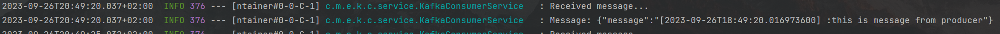

[](https://dl.circleci.com/status-badge/redirect/gh/m-remis/kafka-producer-consumer-demo/tree/main)

## Spring kafka producer - consumer demo

#### Two Simple Spring Boot demo applications (producer - consumer) that utilize Kafka message broker

This project uses:

* Java 17
* Maven
* Spring Boot 3 framework
* Kafka

This is multi-module project

Producer and consumer are spearate microservices, third module contains just common dto used for messages

Project utilizes dependency management with parent 

### Make sure to have installed

[Git](https://git-scm.com/downloads)

[JDK 17 or later](https://adoptium.net)

[Maven 3.8.8 or later](https://maven.apache.org/download.cgi)

[Docker](https://www.docker.com/products/docker-desktop/)


### Before starting

Build & test
```
mvn clean install
```
Start dependencies in docker containers
```
docker-compose up -d
```

### Start consumer microservice

```
java -jar kafka-producer-consumer-demo\kafka-consumer\target\kafka-consumer.jar
```

### Start producer microservice

```
java -jar kafka-producer-consumer-demo\kafka-producer\target\kafka-producer.jar
```

- Topics and group id are configurable

    [Consumer properties](kafka-consumer/src/main/resources/application.yml)

    [Producer properties](kafka-producer/src/main/resources/application.yml)
    
    default topic: "test-topic"

    default consumer group: "test-group"

#### "Hold your horses you magnificent beast, how the fuck do I know it if works ?"

Glad you asked, this fine piece of machinery can be observed through the magic of glorious technology called logging

Producer will produce logs every 5 seconds


Consumer will consume them and log them



TODO: Unit tests with test containers integration